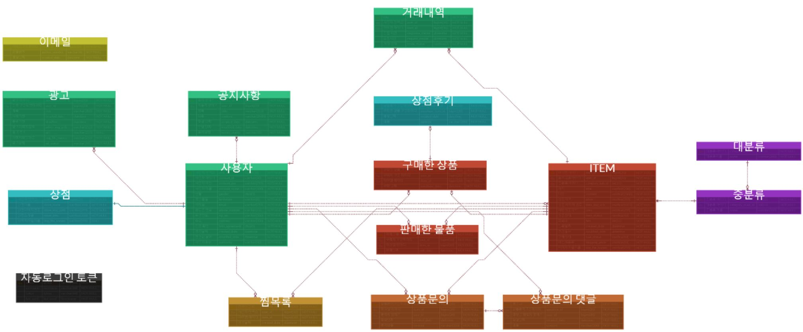
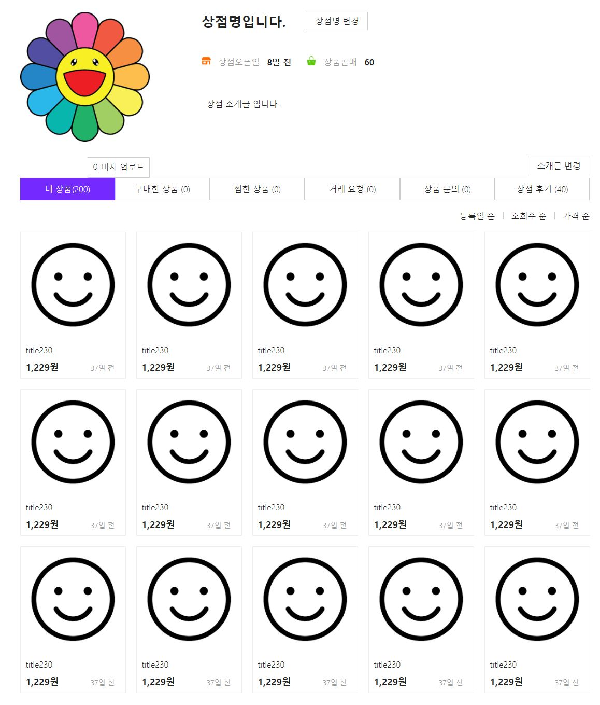

# 내꼬니꼬
***
　중고나라, 번개장터, 당근마켓 등 중고거래 플랫폼에서 착안해, 중고 상품을 거래 할 수 있는 웹서비스를 기획 했습니다.  
 　판매자, 구매자, 관리자 관점에서 요구사항을 분석하고, 분석한 내용을 분담하여 서비스 구현을 진행했습니다.   

### 팀원
|이름|이메일주소|핸드폰번호|
|:---:|---|---|
|김대희|dae4414805@gmail.com|010-9929-4805|
|김원겸|||
|이택민|||
|최정연|||

# 사용 기술
***
### BACK-END
  * JAVA 11
  * GRADLE
  * SPRING
    * SPRING-BOOT
    * SPRING-SECURITY
  * MYBATIS
  * JUNIT5
    
### FRONT-END  
  * BOOTSTRAP
  * JAVASCRIPT
    * AJAX
    * JQUERY
### DB  
  * ~~ORACLE~~
  * MYSQL

# 요구사항
***
### 회원
* 회원 가입
* 로그인 및 로그아웃
* 개인정보 수정
* 판매, 구매, 찜 상품 확인
### 상품
* 상품 등록 및 수정
* 거래 요청
* 상품 찜하기
* 상품 검색
* 상품 문의 및 댓글
### 상점
* 내 상점과 다른 회원 상점 
* 상점 정보 등록 및 수정
* 거래 승인
* 상품 목록 및 정렬
### 관리자
* 회원 목록 조회
* 회원 그룹별 조회(연령/성별/지역)
* 카테고리별 등록 조회
* 거래 완료 비율 조회
* 카테고리 추가 및 수정
* 공지사항 작성, 수정, 숨기기
* 광고 작성 및 수정

# DB
***
  
<a href="https://www.erdcloud.com/d/wABSja6NBHZbJcNJY" target="_blank">상세 보기</a>

# 페이지 구현
***
### 메인

### 아이템

### 상품관리

### 상점

구현 기능 보기

* 상점 정보 수정 기능
  
  

### 관리자